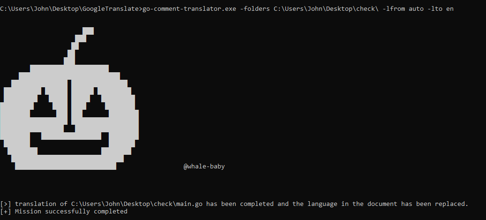

# Go Comment Translator

## Introduction

Go Comment Translator 是一个用于自动翻译 Go 项目中注释和输出信息的工具。它通过正则表达式匹配代码中的中文内容，并调用 Google Translate API 进行翻译，最后将翻译后的英文内容替换回原文件。该工具旨在帮助开发者快速将 Go 项目国际化。

## Features

- **自动翻译**：自动检测并翻译 Go 源文件中的中文注释和输出信息。
- **高效处理**：使用正则表达式快速准确地匹配文本。
- **易于集成**：无需对现有 Go 项目进行大量修改，即可无缝集成。
- **多线程支持（即将推出）**：下一个版本将支持多线程，进一步提升翻译速度和性能。

## Usage

### 安装使用

1. **克隆仓库**：

   ```bash
   git clone https://github.com/your-username/go-comment-translator.git
   cd go-comment-translator
   ```

2. **程序编译**

    ```bash
    go mod tidy
    go build main.go
    ```

3. **程序使用**(因为调用了Google翻译的API，程序运行需要连接互联网)
    
    ```bash
    > go-comment-translator.exe -folders <项目路径> -lfrom <默认为auto> -lto <翻译为什么语言>
    ```

    