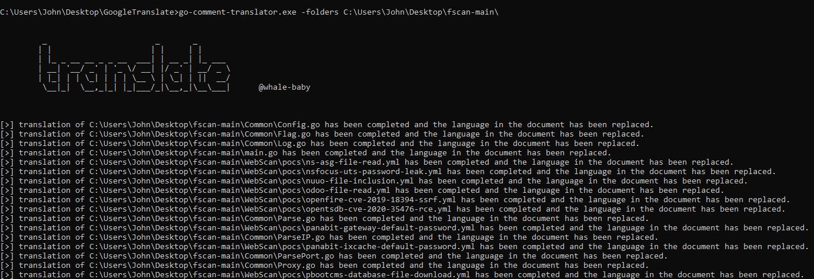

# Go Comment Translator

## Introduction

Go Comment Translator 是一个用于自动翻译 Go 项目中注释和输出信息的工具。它通过正则表达式匹配代码中的中文内容，并调用 Google Translate API 进行翻译，最后将翻译后的英文内容替换回原文件。该工具旨在帮助开发者快速将 Go 项目国际化。

## Features

- **自动翻译**：自动检测并翻译 Go 源文件中的中文注释和输出信息。
- **高效处理**：使用正则表达式快速准确地匹配文本。
- **易于集成**：无需对现有 Go 项目进行大量修改，即可无缝集成。
- **多线程支持（即将推出）**：下一个版本将支持多线程，进一步提升翻译速度和性能。

## Installation

### Clone Repository

```bash
git clone https://github.com/your-username/go-comment-translator.git
cd go-comment-translator
```

### Run the program
```bash
go mod tidy
go build main.go
```

## Usage

### Basic Usage

运行程序时，需要指定以下参数：
```bash
./go-comment-translator -folders <项目路径> -lfrom <源语言> -lto <目标语言>
参数说明：
-folders：指定需要翻译的项目路径。
-lfrom：源语言（默认为 auto，表示自动检测语言）。
-lto：目标语言（例如 en 表示翻译为英文）。
```



### Example

假设你有一个名为 my-go-project 的项目，想要将其中的中文注释翻译为英文，可以运行以下命令：
```bash
./go-comment-translator -folders ./my-go-project -lfrom auto -lto en
```

## Notes

**1. 网络连接：** 由于工具依赖 Google Translate API，运行时需要确保网络连接正常。

**2. 翻译限制：** Google Translate API 有每日调用次数限制，请合理使用。

## Contribution

欢迎贡献代码或提出改进建议！请按照以下步骤提交贡献：

1. Fork 项目到你的 GitHub 账号。
2. 创建一个新的分支：git checkout -b feature-branch
3. 提交你的更改：git commit -m "Your commit message"
4. 推送到远程仓库：git push origin feature-branch
5. 提交 Pull Request 到主仓库。
